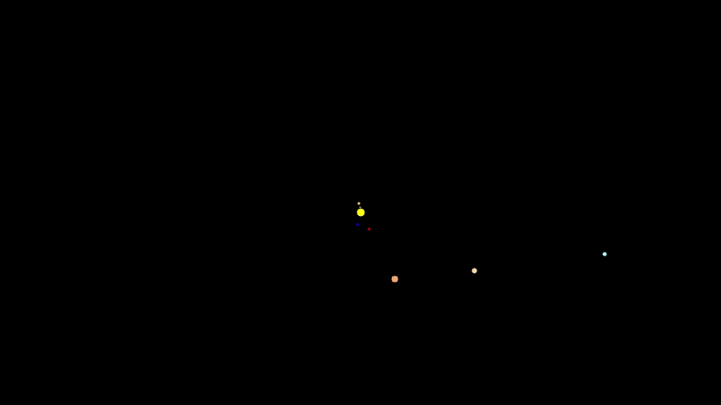

  <h1>Miniverse</h1>
  
  
<i>A simulation of the Solar System running inside Miniverse</i>

<h2>About</h2>
Miniverse is a tiny universe sandbox (inspired by games like Universe Sandbox, https://universesandbox.com/) that simulates actual physical interactions between celestial bodies. Minverse is built with native Rust and can run on any machine that has a current version of Rust configured.
  
The underlying implementation uses a Model-View-Controller (MVC) algorithm for separating UI and physics processing. The algorithm used for managing the physics between bodies is the Barnes-Hut Algorithm (https://arborjs.org/docs/barnes-hut) for simulating n-bodies. The key speedup from this algorithm comes from the partitioning of 2D space into quadrants, allowing for the use of a quad-tree, where each node in the tree holds references to the bodies currently in that quadrant. If more than one body exists in the same quadrant, that quadrant is subdivided into four more quadrants until the two bodies are in their own quadrant. Forces are then calculated between the bodies using a distance threshold: If one body is far enough away from a quadrant containing a set of bodies, the entire quadrant's center of mass will be used instead of each individual body's in the force calculation. This provides a vast improvement over the polynomial time taken for brute force calculations.

<h2>Getting Started</h2>
To play with the Miniverse application yourself, simply git clone this repo and use "cargo run" in the rust application directory to start the app.
